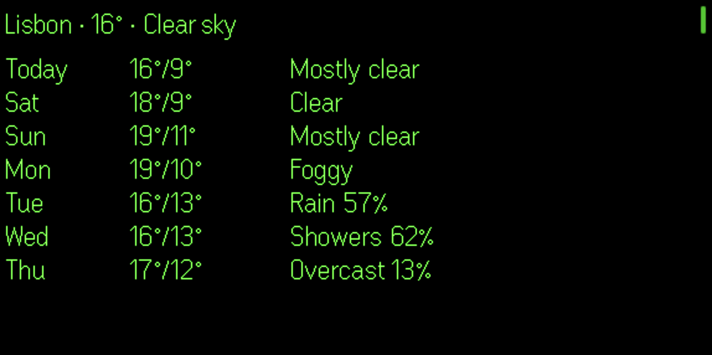
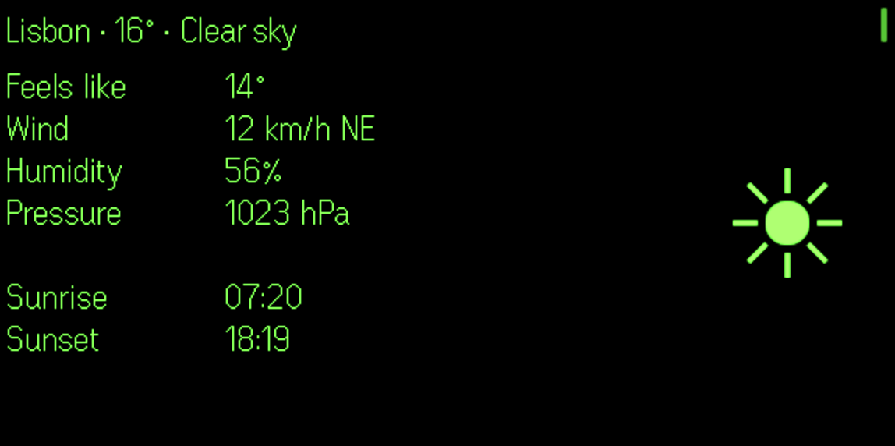
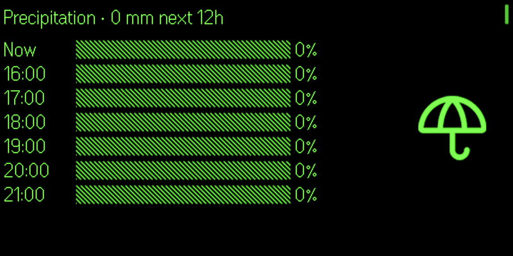

# Weather Even G2

> See also: [G2 development notes](https://github.com/nickustinov/even-g2-notes/blob/main/G2.md) – hardware specs, UI system, input handling and practical patterns for Even Realities G2.

Weather forecast for [Even Realities G2](https://www.evenrealities.com/) smart glasses.

Five screens – weekly forecast, current conditions, precipitation chart, wind chart and 18-hour hourly forecast – driven by the free [Open-Meteo](https://open-meteo.com/) API with no API key required.

Uses native text containers with aligned multi-column layouts and small image overlays (weather icons, PNG labels). All within the G2's 4-container-per-page limit and 200x100 image size constraint.

### Try it now

Scan this QR code in the Even Realities app (Even Hub page) to use on your G2 glasses:







## System architecture

```
[G2 glasses] <--BLE--> [Even app / simulator] <--HTTP--> [Open-Meteo API]
```

No backend server needed. The browser calls Open-Meteo directly (free, CORS-enabled).

## Screens

1. **Weekly forecast** – 4 containers: header (city + temp + condition), day names column, temperatures column, conditions column
2. **Current conditions** – 4 containers: header, labels column, values column, 100x100 weather icon image
3. **Precipitation** – 4 containers: header (total mm), time column, horizontal bar chart (Unicode block characters), umbrella icon image
4. **Wind** – 4 containers: header (current speed + direction), time column, horizontal bar chart, wind icon image
5. **Hourly forecast** – 2 text containers side by side, 9 hours each (18 hours total)

## Navigation

| Input | Action |
|---|---|
| Swipe down | Next screen |
| Swipe up | Previous screen |
| Double tap | Refresh weather + go to first screen |

## Setup

```bash
npm install
```

### Run with even-dev

Requires [even-dev](https://github.com/BxNxM/even-dev) (Unified Even Hub Simulator).

```bash
# Symlink into even-dev (adjust paths to your local setup)
ln -s /path/to/weather-even-g2/g2 /path/to/even-dev/apps/weather

# Run
cd /path/to/even-dev
APP_NAME=weather ./start-even.sh
```

### Run standalone

```bash
npm run dev
```

### Deploy to glasses

```bash
# Terminal 1: start dev server
npm run dev

# Terminal 2: generate QR code
npm run qr

# Scan QR code with Even App on your phone
```

### Package for distribution

```bash
npm run pack
# Creates weather.ehpk
```

## App architecture

```
g2/
  index.ts         App module registration
  main.ts          Bridge connection + settings UI bootstrap
  app.ts           Thin orchestrator: initApp, refreshWeather
  state.ts         WeatherData types, app state singleton, bridge holder
  api.ts           Open-Meteo geocoding + forecast API client
  renderer.ts      Screen rendering (text containers + image overlays)
  events.ts        Event normalisation + screen dispatch
  icons.ts         Canvas-based weather icon renderer (7 icon types)
  layout.ts        Display dimension constants
  ui.tsx           React settings panel (city search, connection)

_shared/
  app-types.ts     AppModule/AppActions contract
  log.ts           Event log utility
```

## Tech stack

- **Weather API:** [Open-Meteo](https://open-meteo.com/) (free, no API key)
- **G2 frontend:** TypeScript + [Even Hub SDK](https://www.npmjs.com/package/@evenrealities/even_hub_sdk)
- **Settings UI:** React + [@jappyjan/even-realities-ui](https://www.npmjs.com/package/@jappyjan/even-realities-ui)
- **Build:** [Vite](https://vitejs.dev/)
